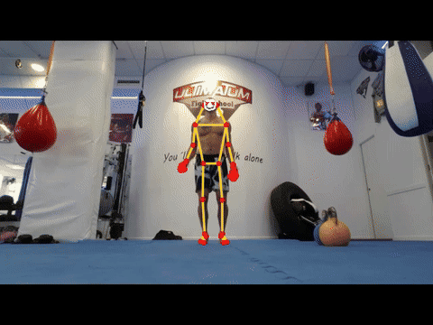

# smplx-rt

Real-time whole-body human pose in C++: video -> person detector -> 133-keypoint whole-body pose
(body, feet, face, hands) -> overlay, with per-stage p50/p99 latency. It is the first stage of a
monocular SMPL-X body-mesh pipeline aimed at 60 FPS on an NVIDIA RTX GPU.



## Status

| Part | State |
|---|---|
| C++ pipeline: OpenCV decode, YOLOX-tiny detector, RTMW-l-m whole-body pose, SimCC decode, overlay | working, ONNX Runtime on CPU and CoreML |
| Parity with the Python reference (rtmlib) on the same frames | mean 0.001 px, see below |
| One Euro keypoint smoothing (`--smooth`) | working |
| SMPL-X regressor and full SMPL-X forward pass | not started; only the sparse LBS step exists (CPU) |
| CUDA preprocess and LBS kernels, TensorRT | written, never compiled or run (no NVIDIA GPU here) |

## Build and run (macOS, Apple Silicon)

Needs an unpacked [ONNX Runtime release](https://github.com/microsoft/onnxruntime/releases)
(1.30.0 used here, it includes the CoreML EP) and OpenCV 4 with core, imgproc, imgcodecs, videoio.

```bash
cmake -S . -B build -G Ninja -DSMPLXRT_WITH_ORT=ON \
  -DONNXRUNTIME_ROOT=/path/to/onnxruntime-osx-arm64-1.30.0 \
  -DOpenCV_DIR=/path/to/opencv/lib/cmake/opencv4
cmake --build build && ctest --test-dir build

./build/pose_video --video data/jumping_jacks.mp4 \
  --det models/downloads/yolox_tiny_humanart.onnx \
  --pose models/downloads/rtmw_l_m_256x192.onnx \
  --device coreml --warmup 100 --frames 1000 --csv runs/coreml.csv --out runs/out.mp4
```

Without `-DSMPLXRT_WITH_ORT=ON` only the dependency-free core and its tests build (this is what CI runs).

Models are the OpenMMLab mmdeploy ONNX exports that rtmlib uses (lightweight whole-body mode):
[YOLOX-tiny HumanArt](https://download.openmmlab.com/mmpose/v1/projects/rtmposev1/onnx_sdk/yolox_tiny_8xb8-300e_humanart-6f3252f9.zip)
and [RTMW-l-m 256x192](https://download.openmmlab.com/mmpose/v1/projects/rtmw/onnx_sdk/rtmw-dw-l-m_simcc-cocktail14_270e-256x192_20231122.zip).
Unzip `end2end.onnx` from each into `models/downloads/` (gitignored).

Test clip: [Jumping jacks and burpees](https://commons.wikimedia.org/wiki/File:Jumping_jacks_and_burpees.webm)
by Taco fleur, CC BY-SA 4.0, converted to H.264, 640x480, 1356 frames.

## Results (Apple M4, 10-core, macOS 26.5)

100 warm-up frames, then 1,000 measured frames. Wall-clock per stage, single thread of control,
video writing excluded.

**Caveat: these runs were on battery at about 5% charge.** The CPU run is clearly throttled: an
earlier 220-frame CPU run on the same build gave 49.5 ms p50 total (32.2 ms pose, 16.2 ms detector).
Treat this table as a first measurement, not a final number.

| Stage | CoreML p50 | CoreML p99 | CPU p50 | CPU p99 |
|---|---:|---:|---:|---:|
| decode | 0.18 | 0.31 | 0.26 | 0.49 |
| detector preprocess | 0.41 | 0.49 | 0.53 | 1.05 |
| detector inference | 15.79 | 37.46 | 27.36 | 54.82 |
| pose preprocess (crop + normalize) | 0.18 | 0.29 | 0.42 | 0.70 |
| pose inference | 20.14 | 30.87 | 56.93 | 101.15 |
| pose postprocess (SimCC decode) | 0.07 | 0.17 | 0.15 | 0.23 |
| draw | 0.16 | 0.33 | 0.38 | 0.58 |
| **total** | **39.79** | **67.18** | **85.83** | **159.31** |
| FPS from p50 | 25.1 | | 11.7 | |

What this says so far:

- Inference is over 90% of the frame. Everything I wrote around the models (decode, letterbox,
  crop, normalize, SimCC decode, draw) costs about 1 ms in total.
- The detector gains little from CoreML. The mmdeploy export has NMS inside the graph, which
  CoreML likely cannot take, so the graph is split. Running the detector every N frames and
  tracking the box in between is the obvious next step.
- The p99 on CoreML is much wider than p50, still to be explained.

## Correctness: parity with rtmlib

`tools/reference_keypoints.py` runs rtmlib (Python) on the same video with the same ONNX files
and compares keypoints above score 0.3 (200 frames, about 25k keypoints):

| Setup | mean | p99 |
|---|---:|---:|
| Same mp4, C++ decodes with AVFoundation, Python with FFmpeg, OpenCV 4.12 vs 5.0 | 0.67 px | 3.74 px |
| Same PNG frames, OpenCV 4.12 vs 5.0 | 0.33 px | 1.31 px |
| Same PNG frames, both OpenCV 4.12 | **0.001 px** | **0.001 px** |

So the remaining gap was the video decoder and the OpenCV version, not the C++ pre/post-processing.

One real discrepancy found on the way: the model's own mmdeploy `pipeline.json` says `to_rgb: True`
for the pose model, but rtmlib feeds it a BGR image with RGB mean/std. This project follows the deploy
config. Reproducing rtmlib's behaviour (`--rtmlib-bgr`) doubles the disagreement (1.38 px vs 0.67 px mean).

## Next

1. Re-run the table on mains power; add a detector-every-N-frames mode.
2. SMPL-X: pick a regressor with a clean ONNX export, verify PyTorch vs ONNX Runtime, implement
   the full forward pass (blendshapes, Rodrigues, kinematic chain) with a parity test against the
   official `smplx` package.
3. NVIDIA: TensorRT FP16 engines, compile and validate the CUDA kernels against the CPU references,
   then fill the optimization ladder in [docs/RESULTS.md](docs/RESULTS.md).
   The planned GPU design is in [docs/ARCHITECTURE.md](docs/ARCHITECTURE.md).

SMPL-X model files are licensed by MPI and are never committed; see
[smpl-x.is.tue.mpg.de](https://smpl-x.is.tue.mpg.de/).
